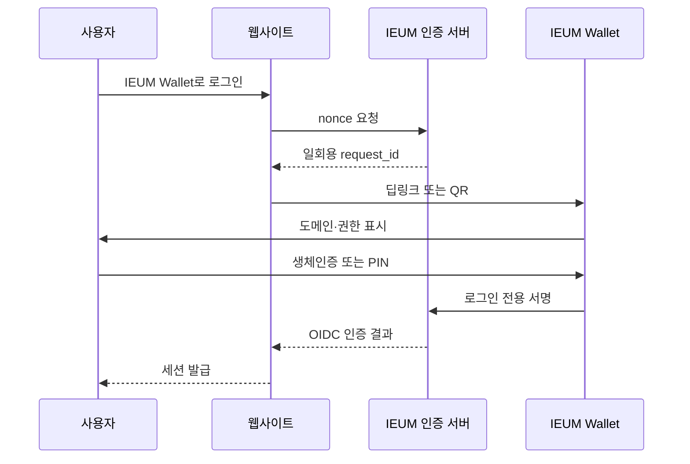
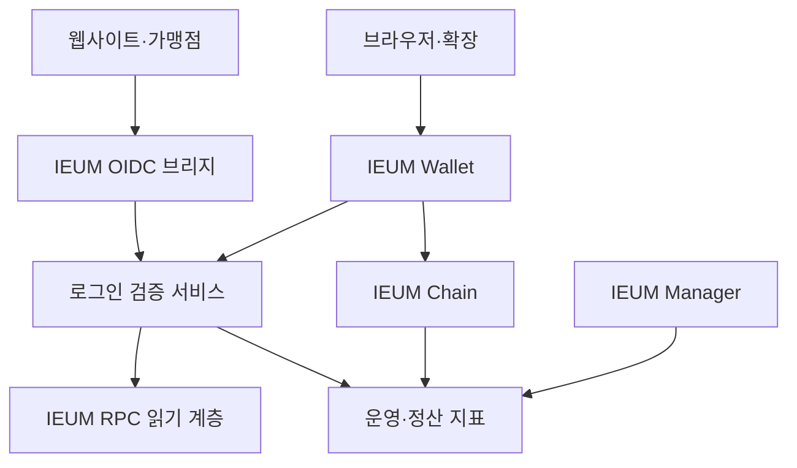
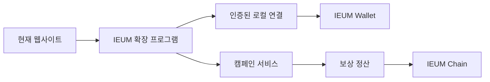

# 확장 방안 모색 1 — IEUM 생활 패스와 IEUM 브라우저

> 상태: 제안 및 사전 설계  
> 작성일: 2026-08-28  
> 대상: IEUM Wallet, Manager, Chain 및 향후 IEUM Browser  
> 주의: 아직 구현되지 않은 확장안이며 현재 운영 기능을 설명하는 문서가 아니다.

## 1. 목적과 결론

IEUM을 사용자가 블록체인이라고 의식하지 않아도 일상에서 쓰게 만드는 확장안이다.

- IEUM Wallet을 로그인·회원증·쿠폰·보상·결제·영수증을 묶은 **IEUM 생활 패스**로 확장한다.
- 사이트 ID·비밀번호, 개인키와 생체정보는 블록체인에 기록하지 않는다.
- 사이트 로그인은 월렛 전자서명과 OpenID Connect(OIDC) 브리지를 사용한다.
- 4자리 PIN은 개인키가 아니라 장치에 있는 월렛의 잠금 해제에만 사용한다.
- IEUM Browser는 가능하지만 Chromium 전체 포크보다 **로그인 SDK → 브라우저 확장 프로그램 → 제한된 브라우저 베타** 순서가 현실적이다.
- 보상은 웹서핑 시간이나 클릭을 무조건 채굴하는 구조가 아니라 광고주가 실제 지급한 확정 수익 안에서만 분배한다.

## 2. IEUM Wallet 로그인

### 2.1 사용자 흐름

1. 사이트에서 `IEUM Wallet로 로그인`을 선택한다.
2. 사이트가 IEUM 인증 서버에서 일회용 nonce와 만료시간을 받는다.
3. 같은 장치는 딥링크, 모바일은 앱 링크, 다른 장치는 QR로 월렛을 연다.
4. 월렛은 사이트 주소, 로그인 목적, 요청 정보와 만료시간을 쉬운 문구로 표시한다.
5. 사용자는 얼굴·지문·Windows Hello·Touch ID·장치 PIN 또는 월렛 PIN으로 승인한다.
6. 월렛이 로그인 전용 메시지에 서명한다.
7. 서버가 서명, nonce, origin, chain ID와 만료시간을 검증한다.
8. 사이트는 OIDC 토큰 또는 기존 세션 쿠키를 발급한다.



### 2.2 자동 로그인 정책

- 월렛 최초 실행 때 운영체제 생체인증 또는 PIN으로 잠금을 해제한다.
- 신뢰 사이트는 월렛이 열려 있을 때 한 번의 승인으로 로그인할 수 있다.
- 송금, 교환, 관리자 기능과 개인정보 제공은 항상 별도 재인증한다.
- 일정 시간 미사용, 화면 잠금 또는 장치 변경 때 다시 잠근다.
- 로그인과 거래 서명 화면의 제목·색상·아이콘을 명확히 구분한다.
- 생체정보 원본은 운영체제 보안 영역 밖으로 가져오지 않는다.

### 2.3 기존 사이트의 ID·비밀번호

IEUM 로그인을 도입하지 못한 외부 사이트는 별도 암호 관리 기능으로 지원할 수 있다.

- ID·비밀번호는 사용자 장치의 암호화 금고에 저장한다.
- 자동 입력은 최소 권한의 브라우저 확장 프로그램이 담당한다.
- 동기화 서버에는 종단간 암호화된 ciphertext만 저장한다.
- 마스터 비밀번호, 복호화 키와 평문 비밀번호는 IEUM 서버와 체인에 보내지 않는다.
- 웹페이지가 월렛 개인키나 비밀번호 금고에 직접 접근하지 못하게 프로세스를 분리한다.

이는 IEUM 전자서명 로그인과 다른 기능이다. 초기 버전에서는 두 기능을 한 화면에 섞지 않는다.

## 3. 로그인 프로토콜 초안

ERC-4361의 Sign-In with Ethereum 흐름을 참고하되 IEUM에 맞는 버전 규격과 테스트 벡터를 정의한다.

```text
iem.aah.name wants you to sign in with your IEUM account:
0x...

Purpose: Sign in
URI: https://iem.aah.name/login
Version: 1
Chain ID: 21004
Nonce: <cryptographically-random-value>
Issued At: <RFC3339>
Expiration Time: <RFC3339>
Request ID: <opaque-id>
Scopes:
- profile.basic
```

필수 검증:

- 실제 HTTPS origin과 메시지의 도메인이 일치해야 한다.
- nonce는 안전한 난수이고 한 번 사용하면 즉시 폐기한다.
- 요청은 짧은 시간 안에 만료한다.
- 주소, 서명 알고리즘, chain ID와 protocol version을 확인한다.
- 승인한 scope 이외의 정보를 사이트에 제공하지 않는다.
- 로그인 서명을 송금이나 임의 메시지로 재사용할 수 없게 서명 목적을 분리한다.
- 인증 장애는 로그인만 중단하고 Chain·Explorer 운영에는 영향을 주지 않아야 한다.

## 4. 구성과 데이터 경계



| 데이터 | 저장 위치 | 체인 기록 |
|---|---|---|
| 개인키 | 사용자 장치 보안 저장소 | 금지 |
| 생체정보 | 운영체제 보안 영역 | 금지 |
| 월렛 PIN | 장치 내 강한 KDF 결과 | 금지 |
| 사이트 비밀번호 | 선택적 로컬 암호화 금고 | 금지 |
| 로그인 nonce | 인증 서버, 짧은 TTL | 금지 |
| 회원증 상세 개인정보 | 사용자 장치 또는 발급자 암호화 저장 | 금지 |
| 자격·영수증 검증값 | 필요한 경우 해시 또는 상태만 | 선택 |
| IEUM 지급·기부·정산 | IEUM Chain | 허용 |
| 광고 관심사·방문 기록 | 사용자 장치에서 로컬 처리 | 금지 |
| 캠페인 정산 합계 | 정산 DB, 필요 시 배치 해시 | 최소 기록 |

## 5. 생활 패스 기능 우선순위

### 우선순위 A

- IEUM Wallet 로그인 및 패스키/생체인증
- aah.name, iem.aah.name 등 자체 서비스 우선 적용
- QR·딥링크 로그인
- 연결 사이트·권한·세션 관리 및 일괄 해제
- 새 장치와 유사 피싱 도메인 경고

### 우선순위 B

- 회원 QR, 방문 스탬프와 쿠폰
- IEUM 결제·지급 및 이벤트 응모권
- 디지털 영수증·보증서
- 제작자·사이트 기부
- 사용자가 승인한 프로필만 제공

### 우선순위 C

- 나이 충족, 회원 등급, 수료 여부 같은 최소 정보 증명
- 가족·고령자용 일일 한도와 보호자 공동 승인
- 등록 복구자 또는 다중 장치 기반 계정 복구
- 외부 개발자용 OIDC SDK

정부 신분증 대체를 먼저 주장하지 않는다. 자체 회원증·참가증·수료증으로 시작한다.

## 6. IEUM Browser 타당성

### 6.1 가능한가

가능하다. Chromium은 오픈소스 브라우저 프로젝트이므로 IEUM Wallet과 보상 UI를 탑재한 브라우저를 만들 수 있다. 하지만 화면을 띄우는 것보다 다음 운영이 훨씬 어렵다.

- Chromium 긴급 보안 업데이트 추적과 빠른 배포
- Windows, macOS, Linux와 Android 패키징
- 샌드박스, 사이트 격리, 인증서, 다운로드와 권한 보안
- 자동 업데이트와 코드 서명
- Chrome 확장 호환성
- 코덱, DRM, 번역, 동기화의 라이선스와 배포 권리 검토
- 크래시 수집과 개인정보 보호
- 웹 콘텐츠·광고 프로세스와 월렛 키 관리 영역 분리
- 앱스토어 정책과 iOS 엔진 제한 확인

따라서 독립 브라우저는 장기 보안 제품으로 봐야 한다.

### 6.2 권장 단계

| 단계 | 제품 | 목적 | 진행 조건 |
|---|---|---|---|
| 0 | IEUM 로그인 SDK | 자체 사이트에서 인증 검증 | 보안 테스트 통과 |
| 1 | IEUM Browser Extension | 기존 브라우저에서 로그인·보상 실험 | 사용자·수익 검증 |
| 2 | IEUM Browser Beta | 제한된 Chromium 데스크톱 베타 | 보안 업데이트 체계 |
| 3 | IEUM Browser | 독립 브라우저 운영 | 전담 인력·지속 수익 |

현재 추천은 1단계까지다. Manifest V3 확장으로도 로그인, 새 탭, 쿠폰, 사이트 기부와 선택형 보상을 검증할 수 있다.



확장 프로그램은 사용자 클릭 시 현재 탭에만 접근하고, 전체 방문 기록 수집과 원격 JavaScript 실행을 금지한다. 월렛 연결은 인증된 Native Messaging 또는 검증된 로컬 IPC를 사용한다.

## 7. 수익과 사용자 보상

Brave Rewards처럼 사용자가 선택한 광고와 제작자 후원을 참고할 수 있지만 IEUM은 보유 서비스와 지역 가맹점부터 작게 시작한다.

| 수익원 | 사용자 가치 | IEUM 측 수익 |
|---|---|---|
| 새 탭 후원 카드 | 선택 시 IEUM 보상 | 캠페인 수수료 |
| 지역 가맹점 쿠폰 | 할인·스탬프 | 가맹점 캠페인비 |
| 검색·구매 제휴 | 선택적 보상 | 제휴 수익 |
| 제작자 후원 | 콘텐츠 직접 지원 | 소액 정산 수수료 |
| 프리미엄 | 광고 없는 동기화·보안 | 구독료 |
| 검증된 참여 | 설문·체험·행사 보상 | 운영 수수료 |
| 영수증·보증 | 보증 관리와 중고 신뢰 | 가맹점 SaaS 요금 |

보상 재원은 다음처럼 제한한다.

```text
광고주 확정 결제액
  - 결제·환불·부정사용 준비금
  - 운영 및 인프라 비용
  - 제작자 또는 가맹점 배분
  = 사용자 IEUM 보상 재원
```

- 광고 수익이 없는데 IEUM을 고정 지급하지 않는다.
- 수익률이나 가격 상승을 보장하지 않는다.
- 총예산, 지급 조건, 종료일과 예상 보상을 먼저 표시한다.
- 광고주 정산 확정 후 지급한다.
- 극소액은 `지급 예정` 원장에 모으고 최소액 도달 시 배치 지급을 검토한다.
- 지급 예정과 실제 온체인 지급 완료를 명확히 구분한다.
- AAH와 IEUM의 고정 환율이나 가격 동일성을 자동 보장하지 않는다.

피해야 할 방식:

- 브라우저를 켜 둔 시간이나 새로고침·클릭 횟수만으로 지급
- 전체 URL·검색어를 서버로 전송
- 동의 없이 기존 광고를 교체하거나 삽입
- 신규 사용자 자금으로 기존 사용자에게 지급
- 월렛 개인키 프로세스에서 광고 스크립트 실행
- 광고주 정산 전에 회수 불가능한 보상 지급

## 8. 개인정보 보호형 캠페인과 부정 방지

1. 광고주가 예산·조건·소재를 등록한다.
2. 브라우저가 캠페인 목록을 받고 사용자 장치에서 로컬 매칭한다.
3. 사용자가 보상 광고를 명시적으로 켠 경우에만 표시한다.
4. 조건 충족 시 일회용 Attention Receipt를 만든다.
5. 서버는 원본 방문 기록 없이 중복·예산·장치 위험 신호를 검사한다.
6. 지급 예정 원장에 기록하고 최소 지급 기준 도달 시 배치 전송한다.

부정 사용 통제:

- 캠페인별 nonce, 만료시간과 1회성 영수증
- 장치·계정·월렛별 속도 제한
- 동일 캠페인 중복 지급 방지
- 자동화 패턴 위험 점수와 지급 유예
- 고액 보상만 단계적 본인확인 검토
- 이의제기와 수동 검토 절차
- 관리자 수동 지급·차감의 이중 승인과 감사 로그

CAPTCHA나 월렛 보유만으로 실제 사람임을 증명한다고 가정하지 않는다.

## 9. 보안 요구사항

- 개인키를 광고·웹 콘텐츠 프로세스와 분리한다.
- OS 보안 저장소와 강한 KDF를 사용한다.
- 4자리 PIN에는 재시도 제한, 지연과 장치 보안을 결합한다.
- 로그인, 정보 제공, 송금, 정기 승인을 다른 서명 목적과 UI로 구분한다.
- HTTPS와 실제 요청 origin을 강제한다.
- 확장은 최소 권한 Manifest V3를 사용하고 무서명 업데이트를 금지한다.
- 광고 소재에서 임의 스크립트를 허용하지 않는다.
- 인증, 캠페인, 지급 서명자를 분리한다.
- 지급은 일일·캠페인별 상한과 다중 승인 정책을 둔다.
- 관리자 JWT, DB 자격증명과 지급 키를 저장소나 Manager 컨테이너에 넣지 않는다.
- 지급 재처리는 멱등해야 하며 같은 보상을 두 번 지급하지 않는다.

## 10. 운영과 규제

IEUM의 교환·매매·수탁·타인 자산 이전까지 제공하면 국가별 가상자산사업자 등록, 고객확인, AML, 트래블룰과 소비자 보호 의무 검토가 필요할 수 있다. 정식 보상 서비스 전 법률·세무 검토가 필요하다.

초기 범위:

- 사용자가 직접 관리하는 IEUM 주소로만 지급
- 타인 자산 수탁 금지
- 현금 출금이나 고정 환율 교환과 분리
- 예상·확정·지급 완료 상태 구분
- 캠페인 약관, 환불, 미성년자, 세금과 부정 지급 기준 마련
- 국가와 플랫폼별 제공 범위 분리

이 문서는 법률 의견이 아니다.

## 11. 단계별 개발 계획

### Phase 0 — 규격과 위협 모델

- IEUM 로그인 메시지 규격 v1과 테스트 벡터
- 서명 알고리즘과 domain separation
- 딥링크·앱 링크·QR 규격
- nonce·세션 폐기 정책
- 로그인/송금 혼동, 피싱, 재사용 공격 테스트

완료 조건: 월렛과 서버가 동일 벡터를 독립 검증하고 변조된 domain·nonce·chain ID·만료시간을 거절한다.

### Phase 1 — 자체 사이트 로그인 MVP

- 월렛 승인 UI와 OIDC 브리지
- aah.name 계열 시험 사이트 한 곳 연동
- 연결 사이트·권한·세션 해제
- Windows Hello/Touch ID 등 플랫폼별 적용
- 사용자 복구 절차

### Phase 2 — IEUM Browser Extension

- Chrome/Edge/Brave 호환 Manifest V3 확장
- 사이트 로그인 요청 전달
- 새 탭 후원 카드 opt-in 시험
- 캠페인 예산·중복 방지·지급 예정 원장
- 소규모 사용자·가맹점 시험

### Phase 3 — 생활 패스

- 회원증·스탬프·쿠폰
- 영수증·보증서와 제작자 기부
- 최소 정보 증명
- 개발자 SDK

### Phase 4 — Browser Beta 결정 조건

- 확장의 활성 사용자와 잔존율 확인
- 반복 구매 광고주 또는 가맹점 수익 확인
- Chromium 보안 업데이트 담당자와 긴급 배포 체계
- 코드 서명과 자동 업데이트 준비
- 월렛 키 격리 보안 검토
- 개인정보·광고·가상자산 법률 검토

## 12. IEUM Manager 설계

공개 지표:

- 지급 완료 총액과 건수
- 활동 중 캠페인 수
- 가맹점·제작자 수
- 개인정보 없는 집계와 온체인 거래 확인 링크

관리자 지표:

- 캠페인 예산·집행·지급 예정·완료·환불
- 중복·부정 의심 처리 상태
- 지급 배치의 생성·승인·전송·확정 상태
- 로그인 성공·거절·만료·서명 오류 집계
- 월렛·확장 버전 호환 상태
- 모든 수동 조정의 감사 이력

관리자 화면에서도 전체 방문 URL, 생체정보, 개인키, PIN, 평문 비밀번호를 수집·열람하지 않는다. 단일 관리자 승인만으로 대량 지급하지 않는다.

### 신규 환경변수 후보

아직 구현하지 않으며 이름과 책임 범위만 기록한다.

| 후보 | 목적 | 기본 정책 |
|---|---|---|
| `IEUM_AUTH_ENABLED` | 로그인 활성화 | 비활성 |
| `IEUM_AUTH_ALLOWED_ORIGINS` | 허용 사이트 | 명시 목록 |
| `IEUM_AUTH_NONCE_TTL_SECONDS` | 요청 만료 | 짧은 TTL |
| `IEUM_REWARDS_ENABLED` | 보상 활성화 | 비활성 |
| `IEUM_REWARDS_MIN_PAYOUT_WEI` | 최소 지급 | BigInt 문자열 |
| `IEUM_REWARDS_DAILY_CAP_WEI` | 일일 상한 | BigInt 문자열 |
| `IEUM_REWARDS_SIGNER_MODE` | 외부 서명자 | Manager 내부 키 금지 |

도입 시 `.env.example`, Docker Compose, CI placeholder, 운영 매뉴얼, 비밀값 회전과 긴급 비활성화 절차를 함께 갱신한다.

## 13. 버전 정책

이 문서는 미래 확장안만 추가하므로 현재 IEUM Manager 애플리케이션 버전을 올리지 않는다.

실제 기능 구현 때는 다음을 한 묶음으로 수행한다.

- `package.json` 마지막 버전 +1 및 표시 버전 정합성
- `docs/VERSION_<버전>_<주제>.md`
- 사용자 매뉴얼과 운영·복구 절차
- README/CHANGELOG
- `.env.example`, Docker Compose와 CI
- 테스트와 Docker 빌드 검증
- 커밋, PR, CI, 태그와 릴리스 문서
- Chain, Wallet, Cold Wallet 호환 버전 확인

제품별 버전은 호환성을 명시하되 억지로 같은 숫자로 맞추지 않는다.

## 14. 성공 지표와 중단 기준

성공 지표:

- 로그인 완료율과 평균 시간
- 비밀번호 재설정 문의 감소
- 7일·30일 활성 사용자
- 캠페인당 확정 수익과 가맹점 재구매율
- 사용자·제작자 실제 지급액
- 부정 지급률과 이의제기 처리시간
- 온체인 지급 비용 대비 지급액

중단 또는 수정 기준:

- 광고 수익보다 보상·부정 사용·운영 비용이 지속적으로 큼
- 사용자가 개인정보 수집으로 오해하거나 동의 철회가 어려움
- 브라우저 보안 패치를 정해진 시간 안에 배포하지 못함
- 봇 사용자가 실제 사용자를 압도함
- 수탁·교환·광고 규제 범위를 감당할 준비가 없음
- 로그인과 거래 서명 혼동 사고 발생

## 15. 참고 자료

- W3C Web Authentication Level 3: https://www.w3.org/TR/webauthn-3/
- ERC-4361 Sign-In with Ethereum: https://eips.ethereum.org/EIPS/eip-4361
- ERC-4337 Account Abstraction: https://eips.ethereum.org/EIPS/eip-4337
- OpenID for Verifiable Presentations 1.0: https://openid.net/specs/openid-4-verifiable-presentations-1_0-final.html
- W3C Digital Credentials API: https://www.w3.org/TR/digital-credentials/
- Chromium Project: https://www.chromium.org/Home/
- Chrome Extensions Manifest V3: https://developer.chrome.com/docs/extensions/develop/migrate/what-is-mv3
- Brave Rewards: https://brave.com/brave-rewards/
- 금융위원회 VASP 등록·AML 강화 발표(2026-08-11): https://www.fsc.go.kr/eng/pr010101/87500

## 16. 최종 제안

IEUM의 다음 제품은 단순히 “코인을 주는 브라우저”가 아니라 **로그인·회원증·쿠폰·결제·정당한 보상을 묶은 IEUM 생활 패스**로 정의한다.

1. IEUM Wallet 로그인 규격과 자체 사이트 적용
2. 확장 프로그램으로 로그인·쿠폰·선택형 보상 검증
3. 광고주 확정 수익 안에서 사용자·제작자·운영 주체 배분
4. 충분한 사용자, 반복 수익과 보안 인력을 확보한 뒤 IEUM Browser Beta 결정

이 순서가 IEUM의 차별성을 빠르게 보여주면서 브라우저 전체 유지 비용과 보안 위험을 통제한다.
